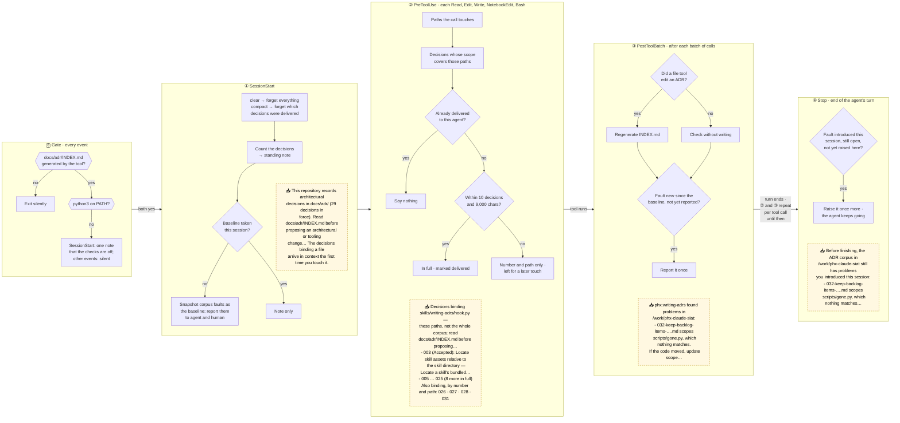

# How the writing-adrs hooks shape a session

The `phx` plugin declares Claude Code hooks ([`hooks/hooks.json`](../hooks/hooks.json))
that run [`skills/writing-adrs/hook.py`](../skills/writing-adrs/hook.py) on six events.
They do two jobs in a repository that records architectural decisions (ADRs) under
`docs/adr/`:

- **Deliver the decisions that govern a file** the first time the agent touches it, so it
  doesn't relitigate a settled choice it never saw ([ADR 025](adr/025-deliver-binding-decisions-by-hook-at-first-touch.md)).
- **Report faults in the decision records once**, rather than on every turn until they're
  fixed ([ADR 026](adr/026-report-findings-by-delta-from-a-session-baseline.md)).

This page assumes you know what Claude Code hooks and their events are. It assumes nothing
about the plugin.

## Terms

- **Scope:** each ADR's frontmatter lists the paths it governs: exact files, or
  directories ending in `/`, which cover everything beneath them.
- **Binding:** a decision binds a path when its scope covers that path.
- **Managed root:** a directory whose `docs/adr/INDEX.md` opens with the tool's generated
  header. Everywhere else, the hooks do nothing.
- **Fault:** something wrong in the corpus, for example a scope entry naming a path that
  no longer exists, a malformed ADR, two ADRs sharing a number or a gap in the numbering, a
  heading whose number disagrees with its filename, a stray file in `docs/adr/`, or a stale
  index.
- **Baseline:** the faults already present when the session started.
- **Session state:** one small JSON file per session, under the plugin's data directory.
  It holds the baseline, the faults already reported, and which decisions each agent
  (main thread or subagent) has already been shown.

## The flow

Stages run left to right through a session. ② and ③ repeat for every tool call until the
agent's turn ends. The dashed yellow boxes are what the agent receives at that stage,
taken from a real run against this repository (shortened; full text below).



**Subagents** get the ① standing note at `SubagentStart`, and nothing else from that
stage, since they share the session's baseline. ② tracks deliveries per agent, so a
subagent receives a decision on its own first touch even when the main thread already has
it. `SubagentStop` runs the ④ check for the subagent.

## What the agent sees, step by step

A recorded session in this repository, 29 decisions in force. Each block is the
`additionalContext` the hook returned, verbatim except for elisions marked `[…]` and the
checkout path, shown as `/work/phx-claude-siat`. Claude Code wraps each one in a system
reminder; none appears as a chat message.

### 1. The session starts

Arrives before the first prompt.

```text
This repository records architectural decisions in docs/adr/ (29 decisions in force).
Read docs/adr/INDEX.md before proposing an architectural or tooling change, so a settled
decision is not relitigated. The decisions binding a file arrive in context the first
time you touch it. Record a new decision with the phx:writing-adrs skill.
```

The corpus has no faults, so nothing else is said and the human sees nothing.

### 2. The agent reads `skills/writing-adrs/hook.py`

Fourteen decisions bind this file, more than the ten a single touch shows. Arrives next to
the `Read` result:

```text
Decisions binding skills/writing-adrs/hook.py — these paths, not the whole corpus; read
docs/adr/INDEX.md before proposing an architectural or tooling change:
- 003 (Accepted): Locate skill assets relative to the skill directory — Locate a skill's
  bundled files relative to the skill's own directory, not via a hook-written plugin root
  pointer. [docs/adr/003-locate-skill-assets-relative-to-skill-directory.md]
- 005 (Accepted): Mirror each skill's declared tooling as a pull-request check — […]
[… 8 more rows: 013, 014, 017, 018, 022, 023, 024, 025 …]
Also binding, by number and path: 026 [docs/adr/026-report-findings-by-delta-from-a-session-baseline.md];
027 [docs/adr/027-anchor-a-script-to-the-tree-it-acts-on.md]; 028 […]; 031 […]
```

Each row is the decision's number, status, title, one-line summary, the condition that
would reopen it (`Revisit when: …`, where it has one), and its file. Only the ten shown in
full are recorded as delivered.

### 3. The agent reads the same file again

Arrives next to the second `Read` result. The four decisions named only by number arrive
in full now:

```text
Decisions binding skills/writing-adrs/hook.py — these paths, not the whole corpus; read
docs/adr/INDEX.md before proposing an architectural or tooling change:
- 026 (Accepted): Report findings by delta from a session baseline — […]
- 027 (Accepted): Anchor a script to the tree it acts on — […]
- 028 (Accepted): Admit ambient project instructions as an archival defence — […]
- 031 (Accepted): Adopt a uv workspace at the repository root — […]
```

From here, none of these fourteen arrive again for the main thread, whatever path it touches:

- `Read pyproject.toml` (bound only by 031, already delivered): no context.
- `Bash: uv run --directory skills/writing-adrs pytest -q`: no context. Paths named in a
  shell command count as touched, but everything binding `skills/writing-adrs/` has
  already arrived.

### 4. A subagent starts and reads `pyproject.toml`

It receives the standing note from step 1, then its own copy of 031, which the main thread
already holds:

```text
Decisions binding pyproject.toml — these paths, not the whole corpus; read
docs/adr/INDEX.md before proposing an architectural or tooling change:
- 031 (Accepted): Adopt a uv workspace at the repository root — Restructure the
  repository as a uv workspace with a root pyproject.toml and one shared uv.lock, […]
  Revisit when: A workspace member needs a dependency version the shared resolution cannot
  satisfy for every member at once. [docs/adr/031-adopt-a-uv-workspace-at-the-repository-root.md]
```

### 5. The agent edits an ADR and leaves a fault

It adds `scripts/gone.py`, which doesn't exist, to ADR 032's scope with the `Edit` tool.
After the batch, the hook regenerates `INDEX.md` and reports the new fault, next to the
`Edit` result:

```text
phx:writing-adrs found problems in /work/phx-claude-siat:
- 032-keep-backlog-items-as-plain-markdown-not-frontmatter.md scopes `scripts/gone.py`,
  which nothing matches. If the code moved, update `scope`; if it is gone, ask whether the
  decision still binds anything, and revisit it
```

Later batches stay silent about it: it has been reported.

### 6. The agent tries to end its turn with the fault still open

Arrives at the end of the turn, labelled `Stop hook feedback` in the transcript. The hook
returns it as `additionalContext`, not `decision: "block"`, and Claude Code continues the
turn so the agent can act on it:

```text
Before finishing, the ADR corpus in /work/phx-claude-siat still has problems you
introduced this session:
- 032-keep-backlog-items-as-plain-markdown-not-frontmatter.md scopes `scripts/gone.py`,
  which nothing matches. […]
```

That happens once. If the agent stops again with the fault unfixed, the hook says nothing
more, and the turn ends.

### 7. A new session starts with that fault in place

The fault becomes part of the new session's baseline. It's reported once, to the agent
before the first prompt and to the human as a visible message (`systemMessage`), and never
again in that session:

```text
This repository records architectural decisions in docs/adr/ (28 decisions in force). […]

phx:writing-adrs found problems in /work/phx-claude-siat:
- 032-keep-backlog-items-as-plain-markdown-not-frontmatter.md scopes `scripts/gone.py`,
  which nothing matches. […]
```

The count drops to 28 because a decision with a fault is left out of the count and out of
`INDEX.md` until it's fixed. A scope fault like this one leaves the decision binding its
other paths, so it still arrives on first touch. A malformed ADR binds nothing until fixed,
and of two sharing a number, the one whose filename sorts second binds nothing.

## Edge cases

- **Resuming** (`resume`) continues the same session, so nothing is delivered or reported
  twice. **Forking** (`fork`) runs `SessionStart` again; whether the fork carries its
  parent's session id, and so its deliveries, is unverified
  ([backlog item](backlog/verify-the-adr-hook-on-a-forked-session.md)).
- **Compaction** (`SessionStart` with `compact`) forgets which decisions were delivered,
  since the compacted context may no longer hold them, so each arrives again on its next
  touch. The
  baseline and reported faults survive. **`/clear`** forgets everything.
- **Size:** one touch carries at most ten decisions in full and stays under 9,000
  characters, inside Claude Code's 10,000-character cap. A decision that doesn't fit is
  named by number and path and delivered in full on a later touch.
- **What counts as a touch:** `Read`, `Edit`, `Write` and `NotebookEdit` by their file
  path; `Bash` by every token in the command that names an existing path, or a file a
  redirect is about to create. `Grep`, `Glob` and `@`-mentioned files deliver nothing.
- **Shell edits to an ADR** aren't the agent's own ADR edit, so `INDEX.md` isn't
  regenerated; a stale index is reported as a fault instead.
- **It never refuses anything.** Every hook exits 0 and returns context only, so no tool
  call or prompt is ever denied. Step 6's one continuation is the only time it changes
  what the agent does next.
- **A crashing hook** reports the error once per session as context and otherwise falls
  silent.
- **No `python3`:** `SessionStart` says once that the ADR checks are off; every other event
  is silent.
- **Parallel calls** share the state file under a lock. A call that can't get the lock
  within about a second says nothing rather than delay the tool.
- **Old state files** are pruned after 30 days, at session start.
